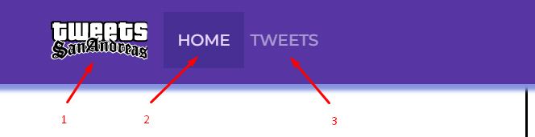

# San Andreas Tweets
## Introduction
This project is a test case. Stylization of the project is a reference to the cult series of computer games "Grand Theft Auto" from Rockstar North. The goal of the project was to create interactive user cards with the possibility of subscribing and unsubscribing to the user's tweets. All users are characters of the computer game "Grand Theft Auto V".

## Interactive elements
1. The logo takes you to the home page
2. The "HOME" button takes you to the home page
3. The "TWEETS" button takes you to the tweets page

4. The "GO BACK" button takes you to the home page
5. The "FILTER" button allows you to filter cards by subscriptions

6. The "FOLLOW"/"FOLLOWING" buttons allows you to follow or unsubscribe from tweets

7. The "LOAD MORE" button allows you to load the next page with tweets

## Adaptive design
* 414px
* 768px
* 1280px

## Technologies and Libraries
* [React](https://react.dev/)
* [React Router](https://www.npmjs.com/package/react-router)
* [JSX](https://react.dev/learn/writing-markup-with-jsx)
* [Axios](https://www.npmjs.com/package/axios)
* [React Spinners](https://www.npmjs.com/package/react-spinners)
* [React Toastify](https://www.npmjs.com/package/react-toastify)
* [React Select](https://www.npmjs.com/package/react-select)

## Backend
[Mockapi](https://mockapi.io/)

## Image storage
[Firebase storage](https://firebase.google.com/)
